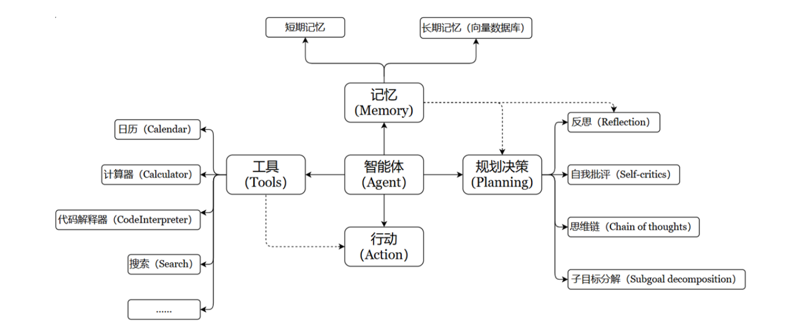

## 简介

### 什么是智能体系统

**智能体** 系统本质上是一种计算实体,能够感知其环境(包括数字和物理环境),根据这些感知和预设或学习到的目标做出决策,并自主执行行动以实现目标。也就是说强调**智能体**的**主动性**和**灵活性**！

例如：在传统开发智能客服中，其客服对话都是按照预设好的流程进行，没有自主性， 也就是说当用户询问的问题超出预设的范围，则无法进行解答。但智能体却可以理解用户的问题，自主选择工具(数据库查询, 内部系统查询等)，并汇总所有结果给用户回答，从而给予用户更好的体验。

智能体特性如下：

1. 自主性: 无需人工干预即可行动;
2. 主动性: 能主动采取行动实现目标;
3. 响应性: 能有效应对环境变化, 以实现目标为导向;
4. 工具: 可使用外部提供的各种工具;
5. 记忆: 拥有短期或长期记忆;

也可以按下图来理解:

