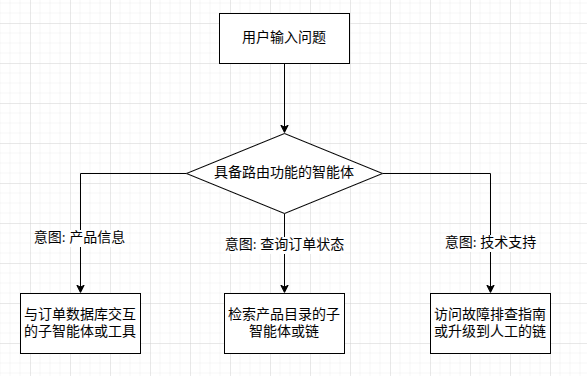

## 路由

### 路由模式概述

虽然通过提示链实现了线性工作流, 可通过llm执行更复杂的操作. 但现实中的智能体系统通常需要根据环境状态, 用户输入或前序操作结果等因素, 在多个潜在动作之间进行仲裁. 这种动态决策能力 -- 即根据特定条件将控制流导向不同的专用函数, 工具或子流程 -- 就是通过**路由**机制实现的.

路由为智能体的操作框架引入了条件逻辑, 使其从固定执行路径变为动态评估特定标准, 从一组可能的后续动作中进行选择的模式, 从而实现更灵活, 具备上下文感知的系统行为.

#### 路由模式实现方式

- **基于LLM的路由:**  通过语言模型进行输入分析, 并输出指示下一步或目标的标识符或指令.
- **基于嵌入的路由:**   将输入查询转为向量嵌入,再与代表不同路由或能力的嵌入进行比对,将查询路由到最相似的路径。适用于语义路由,即决策基于输入的含义而非关键词。
- **基于规则的路由:**   使用预定义规则或逻辑,根据关键词、模式或结构化数据进行路由。
- **基于机器学习模型的路由:**  采用如分类器等判别模型, 在小规模标注数据集上专门训练以实现路由任务。与嵌入方法类似,但其特点是监督微调过程, 路由逻辑编码在模型权重中。与 LLM 路由不同, 决策组件不是推理时执行提示的生成模型, 而是已微调的判别模型。LLM 可用于生成合成训练数据,但不参与实时路由决策。**在有一点数据支撑的前提下，这种判别模型 Router 确实更“科学”、也更快、更稳**

------

### 实践应用与场景

路由模式是设计自适应智能体系统的关键控制机制,使其能够根据输入和内部状态动态调整执行路径. 

- **人机交互:** 路由用于解析用户意图。系统对自然语言查询进行初步分析,决定后续动作.
- **自动化数据与文档处理流程:** 路由承担分类与分发功能。系统根据内容、元数据或格式分析如邮件、工单、API 数据,并将其导向相应工作流.
- **复杂系统:** 路由充当高级调度器。

总之,**路由**为系统提供了逻辑仲裁能力,是构建功能多样、具备上下文感知系统的基础。它将智能体从静态执行者转变为能根据变化条件做出决策的动态系统。

------

### 总结

通过实现路由模式, 智能体不仅能实现简单线性流程, 还能智能决策如何处理信息, 相应用户输入, 调用工具或子智能体, 可对复杂场景进行决策, 解构并调用子智能体或工具来完成任务. 